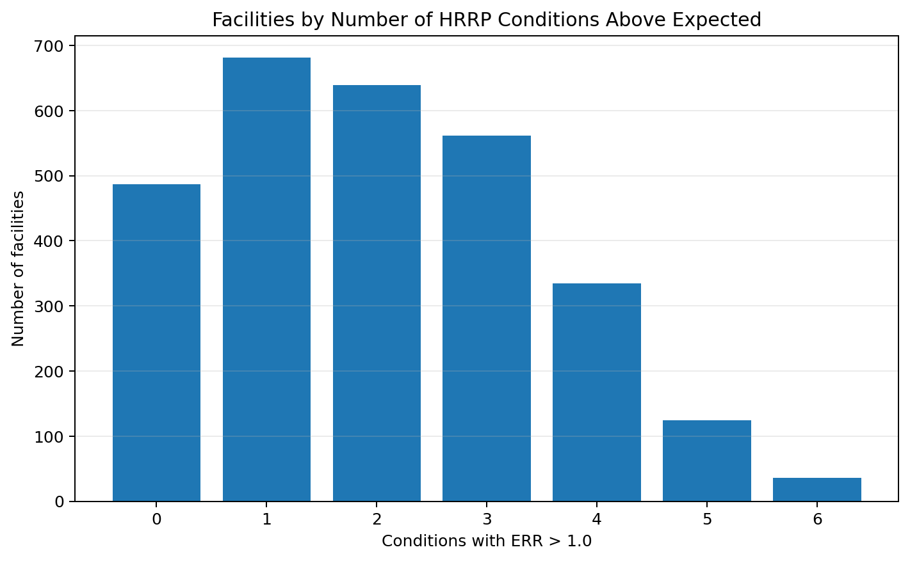
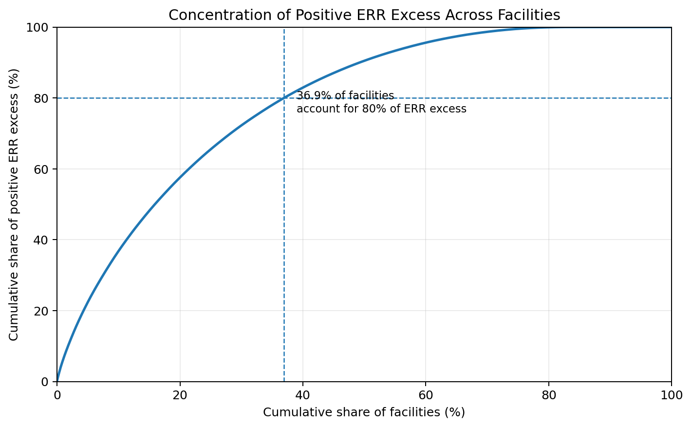

# Hospital Readmissions Reduction Program Analysis

## Executive Summary

This project analyzes Centers for Medicare & Medicaid Services (CMS) Hospital Readmissions Reduction Program (HRRP) data to identify patterns in hospital Excess Readmission Ratio (ERR) performance.

The analysis first tested whether broad **Medical** and **Surgical** HRRP condition groups had meaningfully different ERR patterns. Their mean ERR values were nearly identical, and Welch's two-sample t-test found no statistically significant difference (`p = 0.6419`).

The analysis then shifted to the facility level. The strongest finding was that **1,057 of 2,862 facilities (36.93%) accounted for 80% of the aggregate positive ERR excess above 1.0**. This suggests that the magnitude of above-expected readmission performance was concentrated among a subset of hospitals rather than distributed evenly across facilities.

For a quality-improvement team, this type of analysis could be used as an initial screening tool to prioritize facilities for deeper review before investigating the operational or clinical causes of higher readmission performance.

## Why HRRP Matters

The Hospital Readmissions Reduction Program is a Medicare value-based purchasing program that links hospital payment to readmission performance. CMS uses 30-day risk-standardized unplanned readmission measures for selected conditions and procedures and evaluates hospital performance using the **Excess Readmission Ratio (ERR)**.

Official CMS program information:  
https://www.cms.gov/medicare/quality/value-based-programs/hospital-readmissions

## Business Questions

This analysis focused on two questions:

1. **Do Medical and Surgical HRRP conditions show meaningfully different ERR patterns?**
2. **Is above-expected readmission performance disproportionately concentrated among a smaller group of facilities?**

The goal was not to identify the clinical cause of readmissions, but to determine whether the available CMS data could help narrow where a quality team should investigate first.

## Dataset and Scope

Source: CMS Hospital Readmissions Reduction Program data.

Official CMS dataset:  
https://data.cms.gov/provider-data/dataset/9n3s-kdb3

The source file used for this project contained:

- **18,510 hospital-condition records**
- **3,085 facilities**
- **6 HRRP conditions/procedures**
- **11,927 records with usable ERR values**
- **2,862 facilities with at least one usable ERR value**

The six HRRP measures in the dataset were:

- Acute Myocardial Infarction (AMI)
- Heart Failure (HF)
- Pneumonia (PN)
- Chronic Obstructive Pulmonary Disease (COPD)
- Coronary Artery Bypass Graft (CABG)
- Hip/Knee Replacement

## Key Metric Definitions

### Excess Readmission Ratio (ERR)

ERR compares a hospital's predicted readmissions with the expected readmissions for a hospital treating similar patients.

- **ERR > 1.0:** readmissions were higher than expected
- **ERR = 1.0:** readmissions were approximately as expected
- **ERR < 1.0:** readmissions were lower than expected

### ERR Excess

To measure the **magnitude** of above-expected performance, I created a project-specific prioritization measure:

`ERR Excess = max(ERR - 1.0, 0)`

This gives records at or below 1.0 a value of zero and measures only how far above 1.0 an above-expected record falls.

**ERR Excess is not an official CMS penalty or financial measure.** It was created only to help identify whether above-expected ERR magnitude was concentrated among a subset of facilities.

## Data Validation: AMI Measure Mapping

During an earlier version of the analysis, I noticed that the condition-group counts did not reconcile as expected.

I traced the issue to the Acute Myocardial Infarction (AMI) measure code: the value in my condition mapping did not exactly match the CMS measure code. As a result, **1,763 AMI observations with usable ERR values were left unclassified instead of being assigned to the Medical group**.

I corrected the mapping, reran the affected analysis and statistical test, and added validation checks that:

- confirm all six CMS measures are represented in the mapping
- confirm every record receives a condition type
- stop the analysis if a source measure is missing from the mapping

This validation step was important because the original issue did not remove records from the raw data; it silently affected how those records were classified for analysis.

## Analysis Approach

### 1. Medical vs. Surgical Comparison

The six measures were grouped into:

- **Medical:** AMI, HF, Pneumonia, COPD
- **Surgical:** CABG, Hip/Knee Replacement

Because the groups had different sample sizes and potentially unequal variances, I used **Welch's two-sample t-test**.

### 2. Facility-Level Screening

I then summarized each facility by:

- number of usable HRRP conditions
- number of conditions with ERR above 1.0
- mean ERR

### 3. Concentration Analysis

I evaluated concentration in two ways:

- frequency of conditions above ERR 1.0
- magnitude of positive ERR excess above 1.0

## Key Findings

### Medical vs. Surgical ERR

- Medical mean ERR: **1.0015**
- Surgical mean ERR: **1.0027**
- Welch's t-statistic: **-0.4650**
- p-value: **0.6419**

The analysis did not find evidence of a statistically significant difference in mean ERR between the two broad condition groups.

### Facility-Level Patterns

- **5,814 of 11,927 records (48.7%)** had ERR above 1.0.
- **1,055 of 2,862 facilities (36.9%)** had at least 3 conditions above expected.
- **36 facilities** had all 6 HRRP conditions above 1.0.

### Concentration of Positive ERR Excess

When the magnitude of above-expected ERR was considered, **1,057 facilities (36.93%) accounted for 80% of aggregate positive ERR excess**.

This concentration was more informative than the broad Medical/Surgical comparison because it highlighted a smaller group of facilities contributing disproportionately to the observed above-expected ERR magnitude.

## Recommendation

For an initial quality-review workflow, I would prioritize the facilities contributing the largest share of positive ERR excess and then examine:

- which specific HRRP conditions are driving their results
- whether the pattern persists over additional reporting periods
- patient volume and eligible discharge counts
- hospital characteristics and operating context
- available clinical or operational information that could explain the pattern

The analysis should be used to **prioritize investigation**, not to conclude why a hospital has higher readmissions.

## Limitations

This analysis has several important limitations:

- ERR Excess is a project-specific prioritization metric, not an official CMS financial or penalty measure.
- The concentration analysis is not weighted by patient volume or number of eligible discharges.
- The dataset is aggregated at the hospital-condition level rather than the patient level.
- Facility-level ERR patterns do not establish the causes of readmissions.
- The Welch t-test compares hospital-condition observations and does not model clustering of multiple conditions within the same facility.
- Additional operational, demographic, financial, and patient-level data would be needed before recommending specific interventions.

## Next Steps

If extending this project, I would:

1. Break down high-ERR-excess facilities by individual condition to identify the measures driving each facility's result.
2. Incorporate eligible discharge volume so prioritization reflects both ERR magnitude and patient volume.
3. Compare results across multiple HRRP reporting periods to distinguish persistent patterns from one-period variation.
4. Add hospital characteristics such as geography, hospital type, or other available CMS attributes.
5. Use a facility-aware statistical approach if formally testing differences across repeated condition observations.

## Tools

- Python
- pandas
- SciPy
- matplotlib
- Jupyter Notebook

## Repository Contents

- `hospital_readmissions_analysis.ipynb` — complete analysis, validation, statistical testing, and facility-level findings
- `README.md` — stakeholder-oriented summary of the project
- `images/` — visuals used in this README

## Full Analysis

Open [`hospital_readmissions_analysis.ipynb`](hospital_readmissions_analysis.ipynb) to review the complete workflow, code, validation checks, and outputs.
